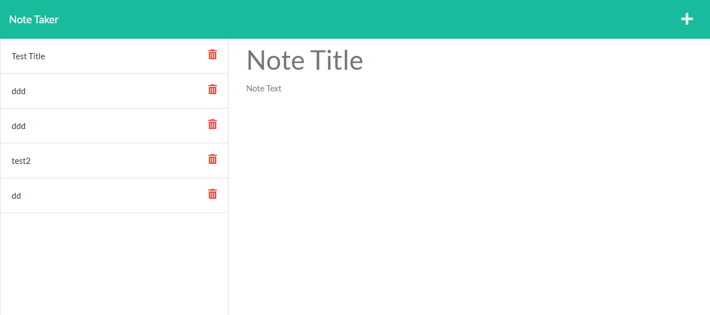

# Note Taker
Created by: Jackson Barker
 
 
## Description
This app allows the user to write and save notes. Providing an application for the user to write and keep track of task.

## Table of Contents

- [UserStory](#userStory)
- [Acceptance Criteria](#AcceptanceCriteria)
- [License](#license)
- [Github](#github)
- [Email](#email)
- [Screenshot](#screenshot)
- [Links](#Links)

## UserStory 

AS A small business owner
I WANT to be able to write and save notes
SO THAT I can organize my thoughts and keep track of tasks I need to complete

## AcceptanceCriteria

GIVEN a note-taking application
WHEN I open the Note Taker
THEN I am presented with a landing page with a link to a notes page
WHEN I click on the link to the notes page
THEN I am presented with a page with existing notes listed in the left-hand column, plus empty fields to enter a new note title and the note’s text in the right-hand column
WHEN I enter a new note title and the note’s text
THEN a Save icon appears in the navigation at the top of the page
WHEN I click on the Save icon
THEN the new note I have entered is saved and appears in the left-hand column with the other existing notes
WHEN I click on an existing note in the list in the left-hand column
THEN that note appears in the right-hand column
WHEN I click on the Write icon in the navigation at the top of the page
THEN I am presented with empty fields to enter a new note title and the note’s text in the right-hand column

## License
MIT
## Github 

 <a href="https://github.com/Jackson-Barker">GitHub Profile Link</a> 

## Email 

<a href="mailto:barkerwjackson@gmail.com">Email</a>

## Screenshot

## Links

<a href="https://github.com/Jackson-Barker/Note-Taker">GitHub Note Taker Link</a>

<a href="https://gentle-gorge-16617.herokuapp.com/">Heroku Note Taker Link</a>